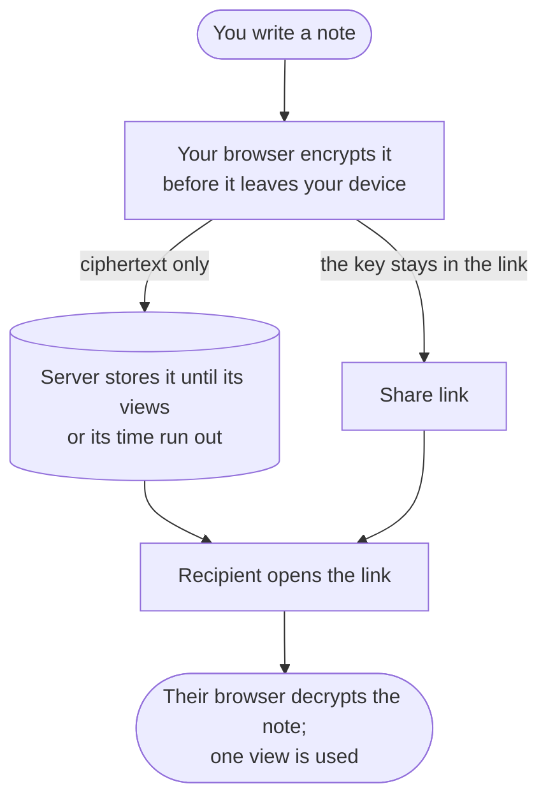

<div align="center">

<p align="center">
  
</p>

<h1 align="center"><strong>Say it once. <em>Sealed.</em></strong></h1>

<p align="center">Zero-knowledge, end-to-end encrypted notes with view limits and expiry.</p>

<p align="center">
  <a href="./SPEC.md">Documentation</a> ·
  <a href="./SECURITY.md">Security</a> ·
  <a href="https://github.com/kaerez/bin/issues">Report a bug</a>
</p>

<p align="center"><sub>secbin by <strong>KSEC - Erez Kalman</strong> · based on
<a href="https://github.com/nxfu/binthere">binthere</a> by nxfu (MIT)</sub></p>

</div>

secbin is a zero-knowledge, end-to-end encrypted pastebin. Write a note, choose how many times
it may be opened and when it expires, get a link, share it. Your browser encrypts everything
with AES-256-GCM **before** it leaves your device, so the server only ever holds ciphertext it
cannot read. Use it for secrets, credentials, private messages, or snippets of code.

## How it works

The design rests on **where the decryption key lives**: in the URL fragment, the part after
`#`, which browsers never send to any server.



1. **You write a note.** Your browser generates a random 256-bit key and encrypts the note
   locally with AES-256-GCM, before any network request is made.
2. **Only ciphertext is uploaded.** The key is never sent; it is appended to your link after
   `#`. The server stores an opaque blob it cannot read.
3. **You share the link** (`…/p/<id>#<key>`). The link *is* the capability to read the note.
   Optionally add a password: it is mixed into the key derivation, so neither the link nor the
   password alone can decrypt.
4. **The recipient opens it.** Their browser fetches the ciphertext, reads the key from the
   fragment, and decrypts locally. The server never sees plaintext.

## Features

| Feature | Details |
| --- | --- |
| Zero-knowledge | Encryption and decryption happen only on the client; the server stores opaque ciphertext and non-secret metadata. |
| View limits | 1 to 100 000 views (default **1**), or unlimited (∞). Finite limits are enforced atomically by a Durable Object: exactly N readers succeed, even under simultaneous opens, and the note is deleted on the last view. |
| Expiry | Any number of minutes, hours, or days from 1 minute to 365 days (default **24 hours**). |
| Optional password | Layered on top of the URL key — neither alone can decrypt. A wrong password never uses up a view. |
| Safe rendering | Auto-detected syntax highlighting and a safe Markdown subset (no raw HTML, sanitized links). DOM construction only — never `innerHTML`. |
| Sharing tools | Copy link, QR code, delete link. |
| Minimal surface | Strict CSP, self-hosted fonts, no third-party scripts, no analytics, no accounts, no outbound requests. |

## What secbin changes from binthere

secbin is a fork of [binthere](https://github.com/nxfu/binthere) (upstream commit `63e5544`).
The cryptographic protocol is unchanged. The differences:

- **Configurable view limits** (1–100 000 or unlimited) instead of fixed one-time view.
- **Configurable expiry** in minutes, hours, or days (1 minute – 365 days) instead of fixed
  24 hours.
- **No external links or APIs:** the GitHub badge and its `/api/stars` proxy, the announcement
  banner, footer links, upstream link-preview metadata, and `security.txt` were removed.
- **Cross-site create guard:** `POST /api/paste` rejects `Sec-Fetch-Site: cross-site` (`403`).
- **Rebranded** to secbin. The internal wire labels (`"binthere/v1"`) are kept so the protocol
  and its test vectors stay identical.

See [`CHANGELOG.md`](./CHANGELOG.md) for details.

## Getting started (local development)

Requires Node.js ≥ 20 (`.nvmrc` pins 22).

```bash
npm install
npm run dev      # wrangler dev → http://127.0.0.1:8787
```

KV, the Durable Object, and rate limiting are emulated locally — no Cloudflare account needed.

| Command | Description |
| --- | --- |
| `npm run dev` | Local dev server at `http://127.0.0.1:8787` |
| `npm test` | All suites: Worker/frontend in `workerd`, DOM/a11y, and the CLI in Node |
| `npm run test:dom` | DOM mount + accessibility suite |
| `npm run test:cli` | CLI suite only |
| `npm run lint` | ESLint 9 (flat config) |
| `npm run kv:create` | Create the `PASTES` KV namespace (+ preview) |
| `npm run deploy` | Deploy with Wrangler |

## Deploying

secbin is a single Cloudflare Worker (Static Assets + KV + a Durable Object + a rate limiter)
and fits within [Cloudflare's free tier](https://developers.cloudflare.com/workers/platform/pricing/).

**From the Cloudflare dashboard (no CLI).** Connect this repository to a Worker with Workers
Builds, or use the button below; every push to the connected branch then redeploys
automatically.

[](https://deploy.workers.cloudflare.com/?url=https://github.com/kaerez/bin)

The importer provisions everything declared in [`wrangler.toml`](./wrangler.toml) — static
assets, the `PASTES` KV binding, the `BurnPaste` Durable Object + migration, and the
`CREATE_RL` rate limiter — and rewrites the resource ids in *your* copy of the config.

**With Wrangler.**

```bash
npm run kv:create        # create your own PASTES KV namespace (+ preview)
# paste the printed id / preview_id into wrangler.toml
npm run deploy
```

<details>
<summary>Deployment checklist</summary>

- Use your own KV `id` / `preview_id` in `wrangler.toml` (template:
  [`wrangler.toml.example`](./wrangler.toml.example)).
- Put the deployment behind Cloudflare Access (next section) unless you intend anyone to be
  able to create pastes.
- Disable the `workers.dev` route and preview URLs, or cover them with the same Access
  applications.
- **Cost note on long-lived pastes:** the web client allows up to 365 days, and the API still
  accepts the legacy preset `expire: "never"` (no KV TTL, no DO alarm). Long-lived or permanent
  pastes carry a small standing storage cost; lower `MAX_TTL` in `public/js/format.js` or
  reject `never` if that matters to you.

</details>

## Protecting a deployment with Cloudflare Access

secbin has no login of its own. Restrict who can **create** pastes with Cloudflare Access while
keeping share links public:

1. **Create a reusable policy** (Zero Trust → Access controls → Policies): Action **Bypass**,
   Include **Everyone**.
2. **Public application** (Access controls → Applications → Add → Self-hosted). Add one
   destination per path on your hostname and attach the Bypass policy only:

   | Path | Why |
   | --- | --- |
   | `p/*` | Viewer pages |
   | `api/paste/*` | Read, consume, and delete calls |
   | `js/*`, `css/*`, `fonts/*`, `img/*` | Assets the viewer loads |

3. **Private application:** the same hostname with an **empty path**, and an **Allow** policy
   for your users.

Access applies the most specific match, so everything else — including `POST /api/paste` —
requires login.

> [!IMPORTANT]
> The public paths must use **Bypass**, not Allow: an Allow policy that includes Everyone still
> makes visitors authenticate. And never enter `api/paste` without `/*` — a wildcard-less path
> also covers the bare create endpoint and would make creation public.

**Verify** in a private (logged-out) window:

1. `https://<host>/` redirects to the Access login.
2. A fresh share link opens and decrypts without a login prompt.
3. In the DevTools console, the following must print a redirect to `/cdn-cgi/access/login…`
   or a `401`/`403` — a `400` means creation is publicly reachable:
   ```js
   fetch("/api/paste",{method:"POST",headers:{"content-type":"application/json"},body:"{}"}).then(r=>console.log(r.status,r.url))
   ```

The Worker's **Access** tab has a "Paste a URL to find matching policies" box that is useful
for checking which application a path matches.

## CLI

[`cli/`](./cli) contains the upstream binthere command-line client. It is kept for test
coverage of the shared protocol modules and is **not rebranded or published** by secbin: it
still installs as `binthere` and defaults to the upstream public server. Against an
Access-protected secbin deployment it can read share links but cannot create pastes without an
Access service token. It also does not expose view-limit or custom-expiry options.

## Architecture

| Piece | Role |
| --- | --- |
| Static Assets (`public/`) | SPA frontend, served directly by the Worker |
| Worker (`src/index.js`) | `/api/*` paste API — stores ciphertext, enforces size/rate/view limits |
| KV (`PASTES`) | Unlimited-view pastes, with native TTL expiry |
| Durable Object (`BurnPaste`) | View-limited pastes (1–100 000 views), atomic view counting, expiry alarm |
| Rate Limiting binding | Abuse mitigation on paste creation (fail-open) |
| Cloudflare Access (deployment) | Who may create pastes; share-link paths bypassed |

See [`ARCHITECTURE.md`](./ARCHITECTURE.md) for the request path and storage routing, and
[`SPEC.md`](./SPEC.md) for the cryptographic protocol, paste format, and view-limit/expiry
extension.

<details>
<summary>HTTP API</summary>

The API only handles ciphertext — encryption happens in the client before `POST`, and the key
fragment never appears in any request. Full details in [`SPEC.md`](./SPEC.md) §10.

| Method & path | Purpose | Success | Errors |
| --- | --- | --- | --- |
| `POST /api/paste` | Create a paste (format v1 JSON, optional `meta.views`) | `201` | `400` invalid · `403` cross-site · `413` too large · `415` content-type · `429` rate-limited |
| `GET /api/paste/:id` | Unlimited: full paste. View-limited: head only (no view spent) | `200` | `404` missing/expired · `410` no views left/expired |
| `GET /api/paste/:id?meta=1` | Head for any paste (no ciphertext, no view spent) | `200` | `404` missing · `410` no views left/expired |
| `POST /api/paste/:id/consume` | Spend one view (`X-Burn-Intent: consume`) | `200` | `400` missing header · `403` cross-site · `404` not view-limited · `410` no views left/expired |
| `DELETE /api/paste/:id` | Delete, with `X-Delete-Token` header | `200` | `400` missing token · `403` wrong token · `404` missing |

The delete token travels in a header — never in the URL — so it cannot land in request logs;
the server stores and compares only its SHA-256.

</details>

<details>
<summary>Project layout</summary>

```
public/            static frontend (CSP-clean; served by Workers Static Assets)
  index.html  css/styles.css  js/*.js  fonts/*.woff2  img/  _headers  robots.txt  favicon.ico
src/
  index.js         Worker: /api/paste routing + asset fallback
  burn-do.js       BurnPaste Durable Object (view counter, expiry alarm)
  lib/             ids, storage routing, rate-limit wrapper
test/              vitest suites (run in workerd), incl. limits.test.js for views/expiry
                   + genvectors.mjs + vectors.expected.txt (pinned crypto vectors)
test-dom/          DOM mount + accessibility suites (happy-dom)
tools/             verify-vectors.py — independent Python cross-check of the vectors
cli/               upstream binthere CLI (vendor/ mirrors public/js, drift-tested)
SPEC.md SECURITY.md ARCHITECTURE.md CHANGELOG.md CONTRIBUTING.md CODE_OF_CONDUCT.md LICENSE
```

</details>

## Limitations

- **Not anonymous or metadata-free.** The server sees IPs, timing, ciphertext size, view
  settings, and the non-secret `adata`. It cannot read your *plaintext*
  ([`SECURITY.md`](./SECURITY.md) §3).
- **No protection from a compromised deployment.** Decryption runs in JavaScript the server
  delivers; a malicious or hacked deployment could serve code that leaks your key
  ([`SECURITY.md`](./SECURITY.md) §4).
- **Lose the link, lose the note.** No accounts and no server-side index — nobody can recover
  or list pastes.
- **A view limit is not copy protection.** Anyone who opens the note can copy it.
- **Passwords can be guessed offline** by someone who already holds the link, because the
  non-consuming peek returns the wrapped key. Use a strong password
  ([`SPEC.md`](./SPEC.md) §8).
- **Password KDF is PBKDF2-SHA256** (310 000 iterations), not a memory-hard KDF.
- **Upstream binthere clients reject secbin-specific metadata** (view limits, custom expiry);
  use the clients in this repository.
- **English only.** The rate limiter fails open (abuse mitigation, not access control).

## FAQ

<details>
<summary>Can the operator read my notes?</summary>

No. Content is encrypted in your browser before upload; the server stores only ciphertext and
non-secret metadata. The key lives in the URL fragment, which browsers never send.

</details>

<details>
<summary>Why does my link say it "has no views left"?</summary>

All of the note's views have been used, or it expired. Opening your own link counts as a view,
which is why the success screen asks for confirmation before opening it.

</details>

<details>
<summary>Does reloading the note use another view?</summary>

Only if you click **Reveal note** again. After a view, the key is removed from the address bar;
open the original link again to use another view (if any remain).

</details>

<details>
<summary>What does the recipient need?</summary>

Just the link and a modern browser (Web Crypto). No account, even when the deployment is behind
Cloudflare Access — share links use bypassed paths.

</details>

## Security

The threat model, non-goals, and vulnerability-reporting process are in
[`SECURITY.md`](./SECURITY.md); the protocol is in [`SPEC.md`](./SPEC.md).

> [!IMPORTANT]
> Report suspected vulnerabilities privately via
> [GitHub private vulnerability reporting](https://github.com/kaerez/bin/security/advisories/new).
> Do not open a public issue with exploit details.

## Contributing

See [`CONTRIBUTING.md`](./CONTRIBUTING.md). Two hard rules carry over from binthere:

1. **Crypto is spec-first.** Changes to the protocol, paste format, or canonical AAD update
   [`SPEC.md`](./SPEC.md) first, then regenerate the vectors with `node test/genvectors.mjs`.
2. **Keep the CSP strict and rendering XSS-safe.** No inline styles/scripts, no CDNs, no
   `innerHTML` on user content.

Run `npm run lint` and `npm test` before opening a PR.

## Acknowledgements

- [binthere](https://github.com/nxfu/binthere) by nxfu — the project secbin is based on
- [PrivateBin](https://privatebin.info) — the zero-knowledge model binthere rebuilt
- [qrcode-generator](https://github.com/kazuhikoarase/qrcode-generator) by Kazuhiko Arase (MIT)
  — vendored in `public/js/qrcode.js`
- [Newsreader](https://fonts.google.com/specimen/Newsreader) by Production Type,
  [Geist](https://vercel.com/font) by Vercel, and
  [JetBrains Mono](https://www.jetbrains.com/lp/mono/) by JetBrains (all SIL OFL 1.1) —
  self-hosted in `public/fonts/`; see
  [`public/fonts/THIRD-PARTY-NOTICES.md`](./public/fonts/THIRD-PARTY-NOTICES.md)

## License

[MIT](./LICENSE). Original binthere © 2026 nxfu; secbin modifications by KSEC - Erez Kalman.
The MIT notice in `LICENSE` must be retained in copies and forks.
