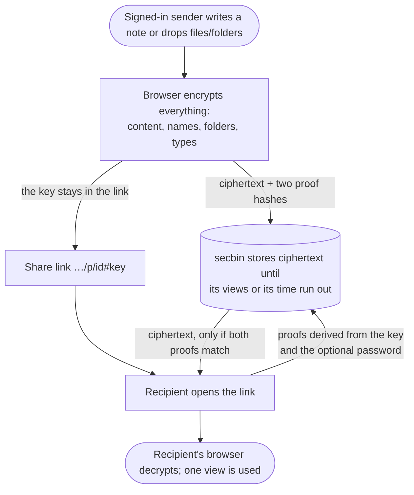

<div align="center">

<p align="center">
  
</p>

<h1 align="center"><strong>Say it once. <em>Sealed.</em></strong></h1>

<p align="center">Zero-knowledge, end-to-end encrypted notes and file sharing — with accounts, view limits and expiry.</p>

<p align="center">
  <a href="./SPEC.md">Protocol</a> ·
  <a href="./SECURITY.md">Threat model</a> ·
  <a href="./cli/README.md">CLI</a> ·
  <a href="https://github.com/kaerez/bin/issues">Report a bug</a>
</p>

<p align="center"><sub>secbin by <strong>KSEC - Erez Kalman</strong> · based on
<a href="https://github.com/nxfu/binthere">binthere</a> by nxfu (MIT)</sub></p>

</div>

secbin lets signed-in users share **notes, files and whole folders** through a link. Everything
is encrypted in the sender's browser (or the CLI) **before** it leaves the device — note text,
file contents, and every piece of metadata about them: file names, folder structure, MIME types,
per-file sizes. The key lives only in the link's `#fragment`, which browsers never send to a
server. Recipients need nothing but the link (and the password, if one was set).

## How it works



1. **Encrypt locally.** A random 256-bit key encrypts the content with AES-256-GCM. An optional
   password is stretched with **Argon2id** and mixed into the key derivation.
2. **Upload only ciphertext** plus two *access-proof hashes*. Files are packed into one padded
   stream and uploaded in encrypted 8 MiB chunks to R2.
3. **Share the link.** It is the capability to read.
4. **Open.** The recipient's browser derives two proofs from the link key (and password). The
   server checks them before it releases ciphertext or spends a view — so a **wrong link or wrong
   password never uses up a view**, and counts toward brute-force protection. Decryption happens
   in the recipient's browser.

## Features

| Feature | Details |
| --- | --- |
| Zero-knowledge | Content, file names, folder structure and MIME types are encrypted client-side. The server stores ciphertext and non-secret settings only. |
| Notes & files | Notes, or any number of files and folders (drag-and-drop, file picker, folder picker). MIME types are auto-detected and editable. |
| View limits & expiry | 1–100 000 views or unlimited; expiry from 1 minute to 365 days. View counting is atomic (Durable Objects). |
| Optional password | Argon2id (64 MiB, t=3). Checked by the server via a proof before any view is spent. |
| Recipient downloads | Tree view: download any file raw, any folder/sub-folder as a ZIP, or everything at once. |
| Safe in-browser viewer | Optional, admin-governed: text, Markdown, code, images, PDF (hardened pdf.js, no PDF scripting), audio/video. Nothing executes. |
| Accounts | Built-in login; one owner/admin; users with per-user capabilities, limits, quotas and API keys. |
| My shares | Senders list their shares, extend views/expiry within their limits, revoke instantly, and label shares. |
| Admin | Users, impersonation ("log in as"), password resets, limits, quotas, session timeouts, file-size caps, viewer policy, brute-force rules, IP allow/block rules, audit log. |
| Brute-force protection | Per-IP tracking for login, setup and invalid fetches (unknown links, wrong keys, wrong passwords); account lockout. |
| CLI | [`secbin`](./cli/README.md): create notes, send files/folders, get/view, delete — with API keys. |
| Minimal surface | Strict CSP, self-hosted fonts, no third-party scripts, no analytics, no outbound requests. |

> [!WARNING]
> **Protocol v2 is a breaking change.** Links created by earlier versions (protocol v1,
> `binthere/v1` labels) can no longer be opened.

## Getting started (local development)

Requires Node.js ≥ 20 (`.nvmrc` pins 22).

```bash
npm install
cp .dev.vars.example .dev.vars   # then fill in AUTHN, SIG, ENC (see below)
npm run dev                      # wrangler dev → http://localhost:8787
```

Open `http://localhost:8787/dashboard/setup/`, enter your `AUTHN` value and create the owner
account. KV, R2, the Durable Objects and everything else are emulated locally.

| Command | Description |
| --- | --- |
| `npm run dev` | Local dev server |
| `npm test` | All suites: Worker in `workerd`, crypto/files in Node, DOM/a11y in happy-dom, and the CLI |
| `npm run test:node` / `test:dom` / `test:cli` | One project only |
| `npm run lint` | ESLint 9 |
| `npm run vendor` | Re-fetch and verify the pinned Argon2id (hash-wasm) and pdf.js builds |
| `npm run kv:create` | Create the `PASTES` KV namespace (+ preview) |
| `npm run r2:create` | Create the `secbin-files` R2 bucket |
| `npm run deploy` | Deploy with Wrangler |

## Deploying

secbin is a single Cloudflare Worker: Static Assets, KV, R2 and four Durable Object classes
(`BurnPaste`, `FileShare`, `Directory`, `Guard`).

1. **Resources** — `npm run kv:create` (put the ids in `wrangler.toml`) and `npm run r2:create`.
   Recommended R2 backstop (the Worker deletes objects itself):
   `wrangler r2 bucket lifecycle add secbin-files --expire-days 366 --abort-multipart-days 1`.
2. **Secrets** — set three Worker secrets (dashboard → Settings → Variables and Secrets, or
   `wrangler secret put <NAME>`). Generate each with `openssl rand -hex 32`, or use the
   generator on `/dashboard/setup` (values are generated in your browser and never sent):

   | Secret | Purpose |
   | --- | --- |
   | `AUTHN` | One-time owner setup / recovery token (≥ 32 characters). **Delete it after setup.** |
   | `SIG` | Session signing key — exactly 64 hex characters. |
   | `ENC` | Session encryption key — exactly 64 hex characters, different from `SIG`. |

3. `npm run deploy`, then open `https://<host>/dashboard/setup/` and create the owner.
4. **Delete `AUTHN`.** The admin panel shows a banner while it is still set. The same value can
   never be used twice anyway.
5. Disable the `workers.dev` route if you do not use it (optional — the Worker authenticates
   every restricted request itself).

Missing or malformed variables never crash the Worker: without `AUTHN`, setup is disabled;
without valid `SIG`/`ENC`, login answers "server not configured" while existing links keep
working.

[](https://deploy.workers.cloudflare.com/?url=https://github.com/kaerez/bin)

## Accounts & administration

- **Owner setup & recovery.** `/dashboard/setup` accepts the `AUTHN` token once. If an owner
  already exists, it *recovers* it: new username/password, all owner sessions revoked. To recover
  later, set a **new** `AUTHN` value and visit the page again.
- **Sessions** are an HttpOnly, `SameSite=Strict`, `__Host-` cookie holding a JWT that is signed
  (HS256, `SIG`) and then encrypted (A256GCM, `ENC`). Idle and absolute timeouts are set by the
  owner. Rotating `SIG`/`ENC` signs everyone out.
- **Passwords** are stretched in the browser with Argon2id; the server only stores a hash of the
  result. Minimum length 12.
- **Users** (owner only): create, disable, delete (optionally revoking their shares), reset a
  password without knowing the old one, unlock, and **log in as** a user — every action taken
  while impersonating is recorded with the real actor in the audit log, while the user's own
  activity shows it as theirs.
- **Capabilities & limits** — defaults for everyone plus per-user overrides: notes/files on or
  off, max views, unlimited views allowed, max expiry, max share size, max single-file size, max
  files per share, in-browser viewer, API keys (on/off, max count).
- **Quotas** — N shares per n seconds/minutes/hours/days/months/years, for all shares, notes or
  file shares. GUI and API creations count together; API-only quotas and API limits can only
  *restrict* further, never widen (e.g. GUI 10/day + API 15/day ⇒ the API still gets at most 10).
- **Settings** — session timeouts, file-share size cap (default 100 MiB, max 2 GiB), download
  window, upload deadline, viewer policy, brute-force rules, lockout rules.
- **Security** — current blocks and tracked IPs per scope, manual allow/block rules for IPv4/IPv6
  addresses and CIDR ranges (allow beats block).
- **Kill switches** — plain env vars, case-insensitive `true`:
  `DISABLE_BFP` (all brute-force protection and IP rules off) and `DISABLE_BFP_SETUP` (setup
  only). Default off.

Cloudflare Access is no longer needed. You may still layer it in front of `/dashboard*` and
`/api/private/*` as defense in depth.

## CLI

```bash
npm install -g ./cli
export SECBIN_SERVER=https://bin.example.com
export SECBIN_API_KEY=sbk_…            # Dashboard → Account → API keys (if the admin allows it)
echo "hello" | secbin create --views 2 --expire 3d
secbin send ./reports report.pdf --password
secbin get 'https://bin.example.com/p/f…#…' --out ./downloads
```

See [`cli/README.md`](./cli/README.md).

## Architecture

| Piece | Role |
| --- | --- |
| Static Assets (`public/`) | Landing + viewer (public) and the dashboard (`public/dashboard/`, served only to signed-in users) |
| Worker (`src/index.js`) | Routes `/api/auth`, `/api/private` (+ admin), the public share API, and gates `/dashboard*` |
| KV (`PASTES`) | Unlimited-view notes (native TTL) |
| `BurnPaste` DO | View-limited notes: atomic proof check + view spend, expiry alarm |
| `FileShare` DO + R2 (`FILES`) | File shares: upload state, views, download grants, R2 cleanup |
| `Directory` DO | Accounts, sessions revocation, API keys, limits, quotas, settings, share index, audit |
| `Guard` DOs | Brute-force tracking and IP blocks, sharded by IP |

See [`ARCHITECTURE.md`](./ARCHITECTURE.md) and [`SPEC.md`](./SPEC.md) (protocol, formats, HTTP API).

## Limitations

- **Not metadata-free.** The server sees IPs, timing, total (padded) ciphertext size, view and
  expiry settings, which account created which share, and share labels (labels are *not*
  encrypted). It cannot read content, names, folders or types ([`SECURITY.md`](./SECURITY.md) §3).
- **No protection from a compromised deployment.** Decryption runs in JavaScript the server
  delivers; a malicious deployment could serve code that leaks keys ([`SECURITY.md`](./SECURITY.md) §4).
- **Lose the link, lose the share.** Keys are never stored server-side.
- **A view limit is not copy protection.** Anyone who opens a share can keep what they saw or
  downloaded.
- **Browser memory.** Large downloads stream to disk in Chromium (File System Access API); other
  browsers assemble the file in memory, which is why shares are capped at 2 GiB.
- **Per-file size and file-count limits are enforced by the client** and declared to the server
  (it cannot verify them — the files are encrypted and packed). The total size is enforced exactly.
- **The file policy (allowed/blocked types, folder depth) works the same way:** when the
  administrator sets one for an account, that account's browser or CLI declares the file types
  and folder depth it is uploading, and the server refuses what the policy forbids. It keeps
  honest users within the rules; it is not a guarantee against a modified client.

## Security

Threat model, non-goals and the vulnerability-reporting process: [`SECURITY.md`](./SECURITY.md).

> [!IMPORTANT]
> Report suspected vulnerabilities privately via
> [GitHub private vulnerability reporting](https://github.com/kaerez/bin/security/advisories/new).

## Contributing

See [`CONTRIBUTING.md`](./CONTRIBUTING.md). Hard rules:

1. **Crypto is spec-first.** Protocol/format/AAD changes update [`SPEC.md`](./SPEC.md) first, then
   regenerate the vectors (`node test/genvectors.mjs`) and cross-check them with
   `python tools/verify-vectors.py`.
2. **Keep the CSP strict and rendering XSS-safe.** No inline styles/scripts, no CDNs, no
   `innerHTML` on user content; viewer renderers never execute content.

## Acknowledgements

- [binthere](https://github.com/nxfu/binthere) by nxfu — the project secbin is based on
- [PrivateBin](https://privatebin.info) — the zero-knowledge model binthere rebuilt
- [hash-wasm](https://github.com/Daninet/hash-wasm) by Dani Biró (MIT) — Argon2id, vendored
- [pdf.js](https://github.com/mozilla/pdf.js) by Mozilla (Apache-2.0) — PDF preview, vendored
- [qrcode-generator](https://github.com/kazuhikoarase/qrcode-generator) by Kazuhiko Arase (MIT)
- Newsreader, Geist and JetBrains Mono (SIL OFL 1.1) — self-hosted fonts

See [`public/THIRD-PARTY-NOTICES.md`](./public/THIRD-PARTY-NOTICES.md).

## License

[MIT](./LICENSE). Original binthere © 2026 nxfu; secbin modifications by KSEC - Erez Kalman.
