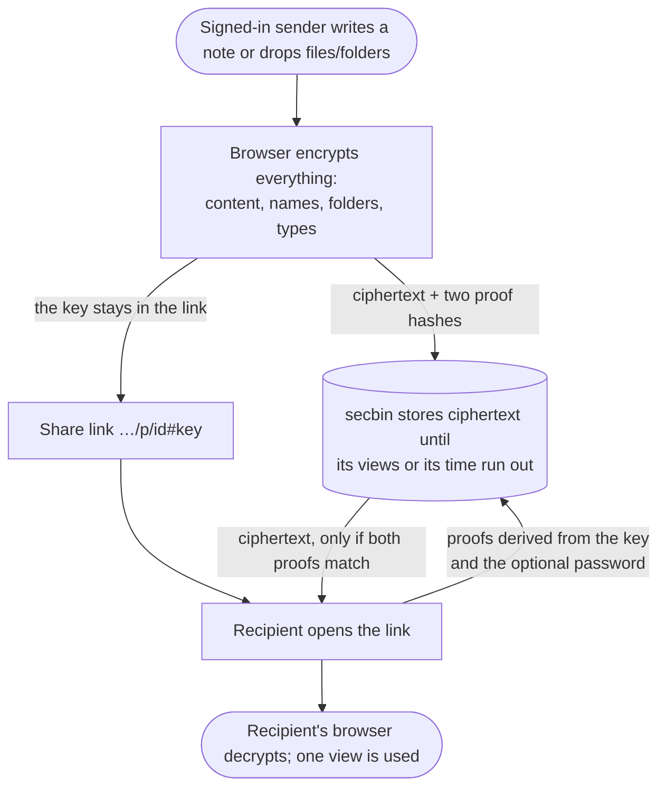

<div align="center">

<p align="center">
  
</p>

<h1 align="center"><strong>Say it once. <em>Sealed.</em></strong></h1>

<p align="center">Zero-knowledge, end-to-end encrypted notes and file sharing — with accounts, view limits and expiry.</p>

<p align="center">
  <a href="./SPEC.md">Protocol</a> ·
  <a href="./SECURITY.md">Threat model</a> ·
  <a href="./cli/README.md">CLI</a> ·
  <a href="https://github.com/kaerez/bin/issues">Report a bug</a>
</p>

<p align="center"><sub>secbin by <strong>KSEC - Erez Kalman</strong> · based on
<a href="https://github.com/nxfu/binthere">binthere</a> by nxfu (MIT)</sub></p>

</div>

secbin lets signed-in users share **notes, files and whole folders** through a link. Everything
is encrypted in the sender's browser (or the CLI) **before** it leaves the device — note text,
file contents, and every piece of metadata about them: file names, folder structure, MIME types,
per-file sizes. The key lives only in the link's `#fragment`, which browsers never send to a
server. Recipients need nothing but the link (and the password, if one was set).

## How it works


```mermaid
flowchart TD
    A([Signed-in sender writes a note or drops files/folders]) --> B[Browser encrypts everything:<br/>content, names, folders, types]
    B -->|ciphertext + two proof hashes| C[(secbin stores ciphertext until<br/>its views or its time run out)]
    B -->|the key stays in the link| D[Share link …/p/id#key]
    D --> E[Recipient opens the link]
    E -->|proofs derived from the key<br/>and the optional password| C
    C -->|ciphertext, only if both proofs match| E
    E --> F([Recipient's browser decrypts; one view is used])
```

1. **Encrypt locally.** A random 256-bit key encrypts the content with AES-256-GCM. An optional
   password is stretched with **Argon2id** and mixed into the key derivation.
2. **Upload only ciphertext** plus two *access-proof hashes*. Files are packed into one padded
   stream and uploaded in encrypted 8 MiB chunks to R2.
3. **Share the link.** It is the capability to read.
4. **Open.** The recipient's browser derives two proofs from the link key (and password). The
   server checks them before it releases ciphertext or spends a view — so a **wrong link or wrong
   password never uses up a view**, and counts toward brute-force protection. Decryption happens
   in the recipient's browser.

## Features

| Feature | Details |
| --- | --- |
| Zero-knowledge | Content, file names, folder structure and MIME types are encrypted client-side. The server stores ciphertext and non-secret settings only. |
| Notes & files | Notes, or any number of files and folders (drag-and-drop, file picker, folder picker). MIME types are auto-detected and editable. |
| Links & credentials | If the admin allows them: a **link** share — http(s) by default; the admin may allow other schemes such as `tel:` or restrict links with regular expressions, with a live tester (the recipient sees the real destination, punycode included, and confirms before it opens — never an automatic redirect; `javascript:`, `data:`, `file:` and similar are never allowed) and a **credential** card (title, user name, password, sign-in URL, notes, and a one-time-code seed with live RFC 6238 codes; secrets masked until revealed). |
| "Delete now" | If the admin allows it and the sender opts in, whoever opens a share can delete it for everyone at once (it needs the full link and password, and spends no view). |
| View limits & expiry | 1–100 000 views or unlimited; expiry from 1 minute to 365 days. View counting is atomic (Durable Objects). |
| Optional password | Argon2id (64 MiB, t=3). Checked by the server via a proof before any view is spent. |
| Recipient downloads | Folder tree on the left (collapsed by default; **+** opens a folder's sub-folders), the selected folder's files and folders on the right: download any file raw, any folder/sub-folder as a ZIP, or everything at once. The composer's file list uses the same tree. |
| Drive | If the role allows it: **Dashboard → Drive**, a private, end-to-end encrypted folder tree (collapsed by default, content in a right pane) within a role capacity — upload files and folders (pickers or drag and drop), new folder, rename, move, delete, download (files raw, folders as ZIP), and **Share…** any files or folders with the usual share options; each item lists its shares with revoke. Unlocked in the browser with the password, a passkey (WebAuthn PRF) or a recovery code. See [`docs/DRIVE.md`](./docs/DRIVE.md). |
| Receive files (reverse shares) | If the role allows it: **Drive → Receive files…** on a folder makes an upload link (`/r/<id>#<key>`, with copy and QR) that lets anyone, without an account, send files and folders into that folder — drag and drop, progress, the human check when configured. Options: expiry, maximum files, total size and file size, allowed file types, a label, an encrypted note to the uploader, and an optional password that only gates the uploader. Files are encrypted in the uploader's browser to the user's key; the user's browser takes them into the Drive when it is unlocked. Listed in My shares (type "receive") and Admin → Shares; revoking stops uploads, received files stay. See [`docs/REVERSE.md`](./docs/REVERSE.md). |
| Safe in-browser viewer | Optional, admin-governed: text, Markdown, code, images, PDF (hardened pdf.js, no PDF scripting), audio/video. Nothing executes. |
| Accounts | Built-in login; one owner/admin; users with one role each (capabilities, limits, quotas, password policy, passkeys, sessions) and API keys. |
| Drive | If the user's role allows it: a private, end-to-end encrypted folder tree within a role capacity (Dashboard → Drive). Any file or folder can be shared any number of times, with the usual share options; when a share ends only the share goes. See [docs/DRIVE.md](./docs/DRIVE.md). |
| My shares | Senders list their shares, extend views/expiry within their limits, revoke instantly, label shares, and see **read receipts** — every open with its time (and, if the admin allows, the opener's address, location, browser, system and languages). |
| Admin | Users, roles (limits, quotas, session timeouts, file-size caps, viewer policy), impersonation ("log in as"), password resets, brute-force rules, IP allow/block rules, audit log. |
| Brute-force protection | Per-IP tracking for login, setup and invalid fetches (links that never existed, wrong keys, wrong passwords — not shares that merely expired); account lockout. |
| Public sharing (optional) | Off by default. The admin can let anyone create notes (and, if allowed, files) from the home page as a built-in public account with its own limits and quotas, counted per browser, per network or both. See SECURITY.md. |
| CLI | [`secbin`](./cli/README.md): create notes, send files/folders, get/view, delete, and list, show, read receipts of, label, extend and revoke your shares — with API keys. |
| Installable | A PWA: install from the banner (or the browser menu; on iOS, Share → Add to Home Screen). The service worker caches only the static shell — never shares or API responses. |
| Minimal surface | Strict CSP, self-hosted fonts, no third-party scripts, no analytics, no outbound requests. |

> [!WARNING]
> **Protocol v2 is a breaking change.** Links created by earlier versions (protocol v1,
> `binthere/v1` labels) can no longer be opened.

## Getting started (local development)

Requires Node.js ≥ 20 (`.nvmrc` pins 22).

```bash
npm install
cp .dev.vars.example .dev.vars   # then fill in AUTHN, SIG, ENC (see below)
npm run dev                      # wrangler dev → http://localhost:8787
```

Open `http://localhost:8787/dashboard/setup/`, enter your `AUTHN` value and create the owner
account. KV, R2, the Durable Objects and everything else are emulated locally.

| Command | Description |
| --- | --- |
| `npm run dev` | Local dev server |
| `npm test` | All suites: Worker in `workerd`, crypto/files in Node, DOM/a11y in happy-dom, and the CLI |
| `npm run test:node` / `test:dom` / `test:cli` | One project only |
| `npm run lint` | ESLint 9 |
| `npm run vendor` | Re-fetch and verify the pinned Argon2id (hash-wasm, @noble/hashes), pdf.js and QR builds |
| `npm run kv:create` | Create the `PASTES` KV namespace (+ preview) |
| `npm run r2:create` | Create the `secbin-files` R2 bucket |
| `npm run deploy` | Deploy with Wrangler |

## Deploying

secbin is a single Cloudflare Worker: Static Assets, KV, R2 and five Durable Object classes
(`BurnPaste`, `FileShare`, `Directory`, `Guard`, `Drive`).

1. **Resources** — `npm run kv:create` (put the ids in `wrangler.toml`) and `npm run r2:create`.
   Recommended R2 backstop (the Worker deletes objects itself):
   `wrangler r2 bucket lifecycle add secbin-files --expire-days 366 --abort-multipart-days 1`.
2. **Secrets** — set three Worker secrets (dashboard → Settings → Variables and Secrets, or
   `wrangler secret put <NAME>`). Generate each with `openssl rand -hex 32`, or use the
   generator on `/dashboard/setup` (values are generated in your browser and never sent):

   | Secret | Purpose |
   | --- | --- |
   | `AUTHN` | One-time owner setup / recovery token (≥ 32 characters). **Delete it after setup.** |
   | `SIG` | Session signing key — exactly 64 hex characters. |
   | `ENC` | Session encryption key — exactly 64 hex characters, different from `SIG`. |

3. `npm run deploy`, then open `https://<host>/dashboard/setup/` and create the owner.
4. **Delete `AUTHN`.** The admin panel shows a banner while it is still set. The same value can
   never be used twice anyway.
5. Disable the `workers.dev` route if you do not use it (optional — the Worker authenticates
   every restricted request itself).

**Optional: Cloudflare Turnstile.** Create a widget in the Cloudflare dashboard (Turnstile →
Add widget, with your hostname), then set `TURNSTILE_SITEKEY` (public; a plain variable is fine)
and `TURNSTILE_SECRET` (a secret). Alternatively, paste both keys in Admin → Security → Human
check; the deployment's keys win when both are set. With both set, login, password changes on the Account page
and anonymous share creation need a passing human check (a visible Cloudflare widget; the
button enables once it passes). Setup, admin password
resets, recipients and API keys never do. Unset either one to turn it off.

Missing or malformed variables never crash the Worker: without `AUTHN`, setup is disabled;
without valid `SIG`/`ENC`, login answers "server not configured" while existing links keep
working.

[](https://deploy.workers.cloudflare.com/?url=https://github.com/kaerez/bin)

## Accounts & administration

- **Owner setup & recovery.** `/dashboard/setup` accepts the `AUTHN` token once. If an owner
  already exists, it *recovers* it: new username/password, all owner sessions revoked. To recover
  later, set a **new** `AUTHN` value and visit the page again.
- **Sessions** are an HttpOnly, `SameSite=Strict`, `__Host-` cookie holding a JWT that is signed
  (HS256, `SIG`) and then encrypted (A256GCM, `ENC`). Idle and absolute timeouts are set by the
  owner. Rotating `SIG`/`ENC` signs everyone out.
- **Passwords** are stretched in the browser with Argon2id; the server only stores a hash of the
  result. The **password policy** (minimum length 1–128, 12 by default, and optionally an
  upper-case letter, a lower-case letter, a digit and a symbol) is set per role, shown next to every
  password field and **enforced by the browser only**: the server never sees a password, so it
  cannot check one. The owner always has the built-in policy (12 characters).
- **Users** (owner only): create, disable, delete (optionally revoking their shares), reset a
  user's password without knowing the old one (never the owner's own — that changes on Account,
  with the current password), unlock, and **log in as** a user — every action taken
  while impersonating is recorded with the real actor in the audit log, while the user's own
  activity shows it as theirs.
- **Roles** (Admin → Roles) — every user has one: Default unless given another. A role sets
  notes/files on or off, max views, unlimited views allowed, max expiry, max share size, max
  single-file size, max files per share, the in-browser viewer and its largest file, API keys
  (on/off, max count or no limit), link rules, file types, read-receipt details, log retention,
  the password policy, passkeys (mode and how many), session timeouts, the file-share download
  window and upload deadline, quotas and viewer rules. Turning the viewer off in a role takes
  effect on that role's existing links at once (each open carries the sender's current policy).
  The Default role holds a value for everything; other roles follow it for whatever they leave
  unset. The locked Owner role never restricts the owner; only the owner's own session timeouts,
  file-share windows and activity-log retention are set there (per-IP protection still applies). The built-in Public
  role holds the public account's options (below); it cannot be renamed, deleted or assigned.
- **Drive** (role options `driveEnabled`, off by default; `driveMaxBytes`, the capacity, 1 GiB by
  default, "no limit" meaning the hard 100 GiB; `driveMaxFileBytes`, the largest file) — each
  allowed user has a private folder tree, encrypted in the browser with a key only they (and,
  through **owner escrow**, the owner) can unwrap. The server sees only the tree's shape, sizes
  and times, never names, types or contents. Drive shares are file shares that reference the
  Drive's ciphertext (nothing is copied): same options, limits and quotas, kind "drive" in My
  shares; deleting a Drive item ends its shares. Admin → Users shows each user's usage; there is
  no admin file browser. Drive content is not exported. Owner escrow lets the owner open any
  user's Drive: each use needs a reason and is logged (`drive.escrow_used`; see
  [SECURITY.md](./SECURITY.md)).
- **Quotas** — N shares per n seconds/minutes/hours/days/months/years, for all shares, notes or
  file shares. GUI and API creations count together; API-only quotas and API limits can only
  *restrict* further, never widen (e.g. GUI 10/day + API 15/day ⇒ the API still gets at most 10).
- **Settings** — server-wide only: brute-force rules, lockout rules, log retention and the
  accessibility statement. Everything an account may do is on its role.
- **Security** — current blocks and tracked IPs per scope, manual allow/block rules for IPv4/IPv6
  addresses, CIDR blocks and ranges such as `10.0.0.5-10.0.0.20` (allow beats block).
- **Import / export** — the owner exports the system configuration and/or some or all users,
  part by part (a table of users × parts with Select all / Deselect all: credentials, role, API
  keys, passkeys, recovery codes; the owner is a row too, with only its passkeys and recovery
  codes; never the owner's password, sessions or shares) to a file **encrypted in the
  browser** with a passphrase (Argon2id + AES-256-GCM), and imports such a file after
  decrypting it locally: the parts chosen again per user, a preview (dry run), per-user
  skip/create/update or rename, then an all-or-nothing import. An import never removes or
  overwrites an existing account's credentials: an existing account (the owner included) only
  gets its role set and the imported passkeys added. Both need the owner's password again.
- **Public access** (off by default) — a built-in `(public)` account that cannot sign in,
  be deleted or hold API keys. When enabled, the home page shows a composer limited to that
  account's limits and quotas (seeded conservatively: notes only, ≤ 10 views, ≤ 7 days, 10 per
  day). Limits are counted per browser (a random identifier kept in a cookie, the ETag cache,
  localStorage and IndexedDB, self-healing; unresolvable conflicts are blocked), per network, or
  both (permissive or restrictive). The composer shows an editable notice. Admin → Public access
  only turns it on or off; the limits, quotas, viewer rules, counting mode, notice and browser ids
  are on the Public role (Admin → Roles); see [SECURITY.md](./SECURITY.md).
- **Activity log** — kept for at most a set age and number of entries (defaults 365 days and
  500 000), with per-role limits. Entries about the owner and the owner's own actions
  (impersonation included) follow the owner's limits instead (Owner role; kept until cleared by
  default); server-wide configuration changes are never deleted automatically. The owner can
  clear everything, one account's entries or entries older than a date (password required; no
  record is kept of the clearing).
- **Passkeys:** each account can add passkeys (Account) and sign in with one instead of the
  password, or require one after the password; 20 one-time recovery codes stand in for a lost
  passkey. The `passkeys` limit (globally or per user) allows both, only the second step, or
  none. The admin can remove a user's passkeys if they lose them all.
- **Human check (optional):** Cloudflare Turnstile on login, password changes and anonymous
  share creation when keys are set (the deployment's, or Admin → Security). Those buttons stay
  disabled until the check has passed, and again after each use until the next one passes.
- **Kill switches** — plain env vars, case-insensitive `true`:
  `DISABLE_BFP` (all brute-force protection and IP rules off) and `DISABLE_BFP_SETUP` (setup
  only). Default off.

Cloudflare Access is no longer needed. You may still layer it in front of `/dashboard*` and
`/api/private/*` as defense in depth.

## Accessibility

The pages are built to **WCAG 2.2 level AA**, which covers the WCAG 2.0 AA base of the Israeli
standard IS 5568. They have skip links, landmarks, full keyboard operation with visible focus,
labelled fields, AA contrast in both themes, reduced-motion support, reflow down to 320 px and
24 px touch targets. Every page and state is checked with axe-core.

- **Preferences button** (bottom corner of every page, in English and Hebrew): high contrast,
  text size, readable font, stop animations, keyboard-focus highlight, and marking of headings
  and links. The choices are saved in the browser and applied before the page paints. It is a
  convenience; the pages do not rely on it.
- **Statement.** `/accessibility/` shows an accessibility statement that the owner edits under
  Admin → Settings → Accessibility: the title, commitment, standard and status, last review
  date, what has been done, known limitations, how to report a problem, and a coordinator if
  you must appoint one. It is plain text (one paragraph or list item per line). The default is
  English only and claims **partial conformance**; you can add a second language (its code and
  direction, e.g. `he` right to left), shown below the first with its own `lang` and `dir`.
  Untranslated headings fall back to the main language's. Without JavaScript the page shows a
  short note instead. The statement is part of the Settings part of an export. "Restore the
  default statement" puts the English-only default back in the form (save to publish it).

## Installing as an app (PWA)

secbin is a Progressive Web App: every page links `/manifest.webmanifest` and registers the
service worker `/sw.js` (both need HTTPS, or `http://localhost` in development).

- **Chrome, Edge and other Chromium browsers** show an *Install secbin* banner once the page is
  installable; **Install** opens the browser's own install dialog. The install icon in the
  address bar keeps working after the banner is dismissed.
- **iPhone and iPad** have no install prompt API, so the banner shows the manual step instead:
  *Tap Share, then Add to Home Screen*.
- The banner is never shown inside the installed app. **Not now** or the close button hides it
  for a year (remembered in the first-party cookie `secbin_pwa_dismiss`; clear site data to
  see it again).

What the service worker does and doesn't cache: it is network-first, stores only same-origin
static assets (`/css`, `/js`, `/fonts`, `/img`, the manifest) and the landing page `/` as an
offline fallback, and **never** intercepts or caches `/api/*`, share pages under `/p/*`,
dashboard pages, or any URL with a query string. Opening a share always needs the network. See
[`SECURITY.md`](./SECURITY.md) §4 for the full rules. Because it is network-first, a deploy
takes effect immediately for online clients; bump `VERSION` in `public/sw.js` when the caching
rules change, and every older cache is deleted when the new worker activates.

The app icons (`public/img/icon-192.png`, `icon-512.png`, `icon-maskable-512.png`) are generated
from the favicon's rosette with `node tools/icons.mjs` and committed.

## CLI

```bash
npm install -g ./cli
export SECBIN_SERVER=https://bin.example.com
export SECBIN_API_KEY=sbk_…            # Dashboard → Account → API keys (if the admin allows it)
echo "hello" | secbin create --views 2 --expire 3d
secbin send ./reports report.pdf --password
secbin get 'https://bin.example.com/p/f…#…' --out ./downloads
```

See [`cli/README.md`](./cli/README.md). To call the REST API directly (curl, Python, Node), see
[`docs/API.md`](./docs/API.md) and [`examples/api/`](./examples/api/). Each API key has scopes:
`notes`, `files` and `policy` to create (the default), and, when chosen, `read` (list your shares
and their read receipts) and `manage` (label, extend and revoke them) — only ever your own
shares, never the account or the admin panel.

## Architecture

| Piece | Role |
| --- | --- |
| Static Assets (`public/`) | Landing + viewer (public) and the dashboard (`public/dashboard/`, served only to signed-in users) |
| Worker (`src/index.js`) | Routes `/api/auth`, `/api/private` (+ admin), the public share API, and gates `/dashboard*` |
| KV (`PASTES`) | Unlimited-view notes (native TTL) |
| `BurnPaste` DO | View-limited notes: atomic proof check + view spend, expiry alarm |
| `FileShare` DO + R2 (`FILES`) | File shares: upload state, views, download grants, R2 cleanup |
| `Directory` DO | Accounts, sessions revocation, API keys, limits, quotas, settings, share index, audit |
| `Guard` DOs | Brute-force tracking and IP blocks, sharded by IP |
| `Drive` DOs + R2 (`FILES`) | Each user's encrypted Drive: folder tree, key wraps, share references |

See [`ARCHITECTURE.md`](./ARCHITECTURE.md) and [`SPEC.md`](./SPEC.md) (protocol, formats, HTTP API).

## Limitations

- **Not metadata-free.** The server sees IPs, timing, total (padded) ciphertext size, view and
  expiry settings, which account created which share, and share labels (labels are *not*
  encrypted). It cannot read content, names, folders or types ([`SECURITY.md`](./SECURITY.md) §3).
- **No protection from a compromised deployment.** Decryption runs in JavaScript the server
  delivers; a malicious deployment could serve code that leaks keys ([`SECURITY.md`](./SECURITY.md) §4).
- **Lose the link, lose the share.** Keys are never stored server-side.
- **A view limit is not copy protection.** Anyone who opens a share can keep what they saw or
  downloaded.
- **Lockdown Mode (iOS/macOS) is slow.** It turns off WebAssembly and the JavaScript JIT, so
  password stretching (Argon2id, 64 MiB) runs in plain JavaScript and can take up to about a
  minute per login or password-protected share; a progress bar shows it. Excluding the site from
  Lockdown Mode (Safari: *Settings → Apps → Safari → Lockdown Mode*; other browsers: the app's
  entry under *Privacy & Security → Lockdown Mode*) makes it instant again.
- **Browser memory.** Large downloads stream to disk in Chromium (File System Access API); other
  browsers assemble the file in memory, which is why shares are capped at 2 GiB.
- **Per-file size and file-count limits are enforced by the client** and declared to the server
  (it cannot verify them — the files are encrypted and packed). The total size is enforced exactly.
- **The file policy (allowed/blocked types, folder depth) works the same way:** when the
  administrator sets one for an account, that account's browser or CLI declares the file types
  and folder depth it is uploading, and the server refuses what the policy forbids. It keeps
  honest users within the rules; it is not a guarantee against a modified client.

## Security

Threat model, non-goals and the vulnerability-reporting process: [`SECURITY.md`](./SECURITY.md).

> [!IMPORTANT]
> Report suspected vulnerabilities privately via
> [GitHub private vulnerability reporting](https://github.com/kaerez/bin/security/advisories/new).

## Contributing

See [`CONTRIBUTING.md`](./CONTRIBUTING.md). Hard rules:

1. **Crypto is spec-first.** Protocol/format/AAD changes update [`SPEC.md`](./SPEC.md) first, then
   regenerate the vectors (`node test/genvectors.mjs`) and cross-check them with
   `python tools/verify-vectors.py`.
2. **Keep the CSP strict and rendering XSS-safe.** No inline styles/scripts, no CDNs, no
   `innerHTML` on user content; viewer renderers never execute content.

## Acknowledgements

- [binthere](https://github.com/nxfu/binthere) by nxfu — the project secbin is based on
- [PrivateBin](https://privatebin.info) — the zero-knowledge model binthere rebuilt
- [hash-wasm](https://github.com/Daninet/hash-wasm) by Dani Biró (MIT) — Argon2id, vendored
- [@noble/hashes](https://github.com/paulmillr/noble-hashes) by Paul Miller (MIT) — pure-JavaScript
  Argon2id fallback when WebAssembly is unavailable, vendored
- [pdf.js](https://github.com/mozilla/pdf.js) by Mozilla (Apache-2.0) — PDF preview, vendored
- [qrcode-generator](https://github.com/kazuhikoarase/qrcode-generator) by Kazuhiko Arase (MIT)
- Newsreader, Geist and JetBrains Mono (SIL OFL 1.1) — self-hosted fonts

See [`public/THIRD-PARTY-NOTICES.md`](./public/THIRD-PARTY-NOTICES.md).

## License

[MIT](./LICENSE). Original binthere © 2026 nxfu; secbin modifications by KSEC - Erez Kalman.
